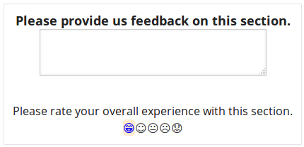

RateXBlock
==========

This is a basic clone of Dropthought for use in Open edX. This doesn't
have all the analytics niceness, and the UX is less polished.

I'm not positioning this as a competitor to DropThought or similar 
services; ideally, once we collect the data, we'll just ship the data 
off to their fancy analytics algorithms, but we won't have to bother
with (a somewhat less reliable, integrated, and performant) 
services-based integration, and we'll have something: 

* Nicely integrated from a user standpoint
* Data lives in the platform, so we can use our own analytics pipeline 
  on it as well. 

As of the time this README is written, we still need to apply styling,
but for now, it looks like:

This can be placed anywhere in the courseware, and students can
provide feedback on those sections. With just a few database queries,
we can compile that feedback into useful insights. ;)

This is not yet installed on edx.org, but hopefully soon will be. It 
installs on any Open edX install same as any other xblock: 

   pip install -e git+https://github.com/pmitros/RateXBlock.git@96c59c683a2647208d7a15e86e6f795b4b9c9bce#egg=rate

From there, add 'rate' to your list of advanced modules, and you're 
good to go. 
