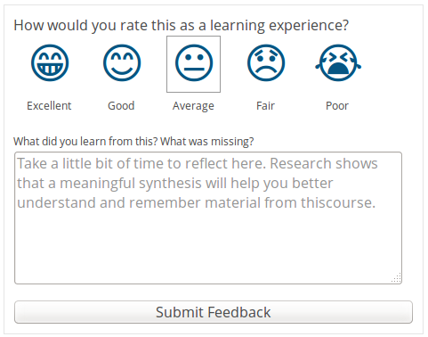
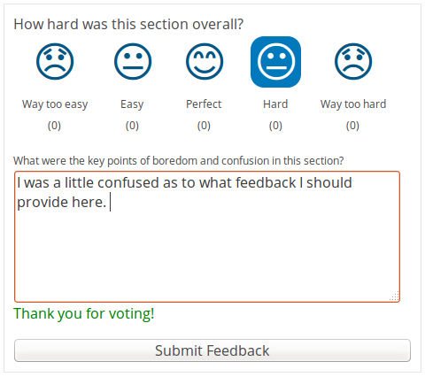
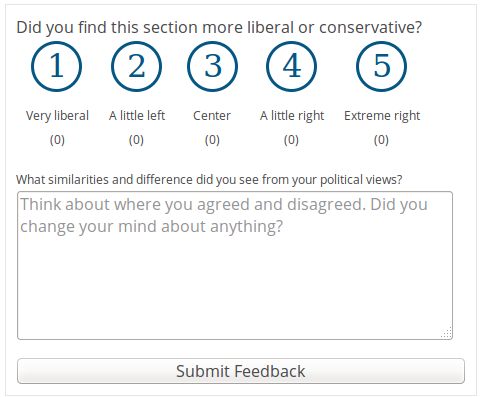

##############
FeedbackXBlock
##############
| |License: AGPL v3| |Status| |Python CI| |Publish package to PyPi|

.. |License: AGPL v3| image:: https://img.shields.io/badge/License-AGPL_v3-blue.svg
  :target: https://www.gnu.org/licenses/agpl-3.0

.. |Python CI| image:: https://github.com/openedx/FeedbackXBlock/actions/workflows/ci.yml/badge.svg
  :target: https://github.com/openedx/FeedbackXBlock/actions/workflows/ci.yml

.. |Publish package to PyPi| image:: https://github.com/openedx/FeedbackXBlock/actions/workflows/pypi-release.yml/badge.svg
  :target: https://github.com/openedx/FeedbackXBlock/actions/workflows/pypi-release.yml

.. |Status| image:: https://img.shields.io/badge/status-maintained-31c653

Purpose
=======

`XBlock`_ is the Open edX component architecture for building custom
learning interactives.

.. _XBlock: https://openedx.org/r/xblock

The FeedbackXBlock encourages learners to reflect on their learning experiences and allows instructors to capture feedback from learners.  Feedback is provided as sentiment on a predefined scale and free text feedback.  Feedback can be aggregated by instructors to understand which parts of a course work well and which parts work poorly.

The block can be placed anywhere in the courseware, and students can
provide feedback related to those sections. With just a few database queries,
we can compile that feedback into useful insights. ;) We do provide
aggregate statistics to instructors, but not yet the text of the
feedback.

The instructors can view reports in their course instructor dashboard. The reports shows the count for every score, the average sentiment score, and the last 10 feedback comments.

Tutor configuration
-------------------

To enable the FeedbackXBlock report in the instructor dashboard, you can use the following tutor inline plugins:

.. code-block:: yaml

    name: feedback-xblock-settings
    version: 0.1.0
    patches:
      openedx-common-settings: |
        FEATURES["ENABLE_FEEDBACK_INSTRUCTOR_VIEW"] = True
        OPEN_EDX_FILTERS_CONFIG = {
          "org.openedx.learning.instructor.dashboard.render.started.v1": {
            "fail_silently": False,
            "pipeline": [
              "feedback.extensions.filters.AddFeedbackTab",
            ]
          },
        }

To enable this plugin you need to create a file called *feedback-xblock-settings.yml* in your tutor plugins directory of your tutor instance
with the content of the previous code block, and run the following commands.

.. code-block:: bash

    tutor plugins enable feedback-xblock-settings
    tutor config save

You can find more information about tutor plugins in the Tutor `plugins`_ documentation.

.. _plugins: https://docs.tutor.edly.io/tutorials/plugin.html

Getting Started
===============

.. TODO Make it possible to run in the Workbench.

For details regarding how to deploy this or any other XBlock in the lms instance, see the `installing-the-xblock`_ documentation.

.. _installing-the-xblock: https://docs.tutor.edly.io/configuration.html#installing-extra-xblocks-and-requirements

Getting Help
============

If you're having trouble, we have discussion forums at
https://discuss.openedx.org where you can connect with others in the
community.

Our real-time conversations are on Slack. You can request a `Slack
invitation`_, then join our `community Slack workspace`_.

For anything non-trivial, the best path is to open an issue in this
repository with as many details about the issue you are facing as you
can provide.

https://github.com/openedx/FeedbackXBlock/issues

For more information about these options, see the `Getting Help`_ page.

.. _Slack invitation: https://openedx.org/slack
.. _community Slack workspace: https://openedx.slack.com/
.. _Getting Help: https://openedx.org/getting-help

How to Contribute
=================

Details about how to become a contributor to the Open edX project may
be found in the wiki at `How to contribute`_

.. _How to contribute: https://openedx.org/r/how-to-contribute

The Open edX Code of Conduct
----------------------------

All community members should familarize themselves with the `Open edX Code of Conduct`_.

.. _Open edX Code of Conduct: https://openedx.org/code-of-conduct/

People
======

The assigned maintainers for this component and other project details
may be found in `Backstage`_ or groked from inspecting catalog-info.yaml.

.. _Backstage: https://open-edx-backstage.herokuapp.com/catalog/default/component/FeedbackXBlock

Reporting Security Issues
=========================

Please do not report security issues in public. Please email security@openedx.org.

History
=======

This is a basic clone of Dropthought for use in Open edX. This used to
be called the RateXBlock. We renamed it for better consistency. We are
keeping the old one around for backwards-compatibility.
